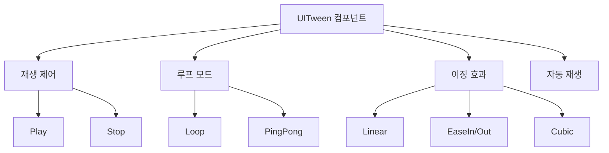
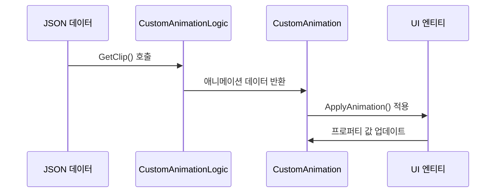
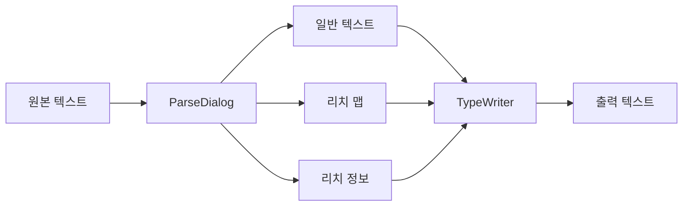

# UI 애니메이션

츄츄버거는 다양한 UI 애니메이션 시스템을 통해 풍부하고 매력적인 사용자 경험을 제공합니다. 기본적인 트윈 애니메이션부터 고급 JSON 기반 애니메이션, 그리고 특화된 타이프라이터 효과까지 포함하고 있습니다.

## 핵심 애니메이션 시스템

### 1. UITween 시리즈

가장 기본적인 UI 애니메이션을 제공하는 컴포넌트 기반 시스템입니다.

#### 기본 트윈 컴포넌트들

##### UITweenAlpha
투명도 애니메이션을 담당합니다.
- **속성**: `from`, `to` (투명도 값)
- **모드**: 루프, 핑퐁, 자동재생
- **용도**: 페이드 인/아웃 효과, 깜빡임 효과

##### UITweenPosition
위치 애니메이션을 담당합니다.
- **속성**: `from`, `to` (위치 벡터)
- **모드**: 상대/절대 위치, 지연 시간 지원
- **용도**: 슬라이드 효과, 이동 애니메이션

##### UITweenScale
크기 애니메이션을 담당합니다.
- **속성**: `from`, `to` (스케일 벡터)
- **모드**: RectSize/Scale 선택 가능
- **용도**: 확대/축소 효과, 펄스 효과

##### UITweenRotate
회전 애니메이션을 담당합니다.
- **속성**: `from`, `to` (회전 각도)
- **축**: Z축 회전
- **용도**: 로딩 스피너, 회전 효과

#### 특수 트윈 컴포넌트들

##### UITweenPopFade
복합적인 팝업 애니메이션입니다.
- **2단계 Y축 애니메이션**: 상승 후 하강
- **X축 포물선 이동**: 자연스러운 궤적
- **페이드 아웃**: 특정 지점에서 투명화
- **랜덤 요소**: 지연과 위치의 랜덤화

##### UITweenConfetti
색종이 효과를 위한 특수 애니메이션입니다.
- **다중 파티클**: 여러 색종이 동시 애니메이션
- **물리 시뮬레이션**: 중력과 바람 효과
- **랜덤 패턴**: 자연스러운 분산 효과

### 2. 공통 트윈 특징

모든 UITween 컴포넌트는 다음 공통 기능을 제공합니다:



## 고급 애니메이션 시스템

### 1. CustomAnimation

JSON 데이터 기반의 고급 애니메이션 시스템으로, 복잡한 멀티 오브젝트 애니메이션을 지원합니다.

#### 핵심 특징
- **JSON 데이터 기반**: 외부 데이터로 애니메이션 정의
- **멀티 프로퍼티**: Transform/Sprite/Text 동시 애니메이션
- **커스텀 곡선**: 자유로운 애니메이션 커브 정의
- **루프/핑퐁**: 다양한 반복 모드
- **프레임 레이트 제어**: 정밀한 타이밍 제어

#### 작동 원리


### 2. UIAnimation

CSV 데이터 기반의 프레임 애니메이션 시스템입니다.

#### 주요 기능
- **프레임 기반**: 키프레임 애니메이션
- **멀티 엔티티**: 여러 UI 요소 동시 제어
- **트윈 보간**: 키프레임 간 부드러운 보간
- **포지션 스케일링**: 해상도 대응

## 타이프라이터 효과 시스템

### 1. IntroOpeningCaption

인트로 시퀀스를 위한 전용 캡션 시스템입니다.

#### 핵심 기능
- **순차적 출력**: 5개 캡션의 연속 출력
- **타이핑 사운드**: 키보드 타이핑 효과음
- **속도 조절**: 후반부 속도 감소
- **하이라이트**: 특수 단어 강조
- **동적 생성**: 런타임 엔티티 생성

#### 타이프라이터 알고리즘

타이프라이터 효과는 실시간 타이머 기반으로 문자를 순차 출력합니다:

1. **길이 계산**: `math.ceil(self.PrintingRepeatTimer * self.Const_PrintRepeatVelocity)`
2. **오프셋 계산**: UTF-8 안전한 문자열 오프셋 계산
3. **부분 문자열**: 계산된 길이만큼 텍스트 추출

<details>
<summary>타이프라이터 알고리즘 구현</summary>

```lua
-- RootDesk/MyDesk/15. Intro/Dialog/IntroOpeningCaption.mlua :: OnUpdate()
-- 핵심 타이핑 로직 
local len = math.ceil(self.PrintingRepeatTimer * self.Const_PrintRepeatVelocity)
local offset = utf8.offset(self.TargetText, len) - 1
local text = string.sub(self.TargetText, 1, offset)
```
</details>

### 2. EventDialogManager

게임 내 이벤트와 다이얼로그를 위한 타이프라이터 시스템입니다.

#### 주요 기능
- **리치 텍스트 파싱**: HTML 스타일 태그 지원
- **스킵 기능**: 즉시 완성 표시
- **콜백 시스템**: 완료 시 이벤트 발생
- **타이밍 제어**: 가변 속도 조절

#### 파싱 시스템


### 3. UIDialogPanel

다이얼로그 UI의 시각적 표현과 상호작용을 담당합니다.

#### 컴포넌트 구조
- **다양한 초상화 타입**: 스프라이트, MSW 아바타, 커스텀 아바타
- **선택지 시스템**: 분기 다이얼로그 지원
- **감정 표현**: 아바타 반응 시스템
- **음성 지원**: 다이얼로그별 음성 재생

## 애니메이션 활용 패턴

### 1. 기본 UI 효과

#### 버튼 클릭 효과
버튼 클릭 시 1.1배 스케일로 확대되는 피드백 애니메이션:
`scaleUp.to = Vector2(1.1, 1.1)` 

#### 팝업 등장 효과  
알파와 스케일을 조합한 자연스러운 팝업 등장:
- **페이드 인**: 0 → 1 알파 변화
- **스케일 업**: 0.8 → 1.0 크기 변화

<details>
<summary>기본 UI 효과 구현</summary>

```lua
-- 버튼 스케일 애니메이션
local scaleUp = UITweenScale:new()
scaleUp.from = Vector2(1, 1)
scaleUp.to = Vector2(1.1, 1.1)
scaleUp.duration = 0.1

-- 알파 + 스케일 조합
local fadeIn = UITweenAlpha:new()
fadeIn.from = 0
fadeIn.to = 1

local popScale = UITweenScale:new() 
popScale.from = Vector2(0.8, 0.8)
popScale.to = Vector2(1, 1)
```
</details>

### 2. 복합 애니메이션

#### 보상 획득 효과
UITweenPopFade를 사용한 아이템 팝업 효과:
`popFade:StartTween(targetPosition, 2.0)` — 2초간 팝업 페이드 애니메이션

#### 색종이 축하 효과  
UITweenConfetti로 파티클 수량을 지정하여 축하 효과:
`confetti:StartEffect(50)` — 50개 색종이 파티클 생성

<details>
<summary>복합 애니메이션 구현</summary>

```lua
-- PopFade를 이용한 아이템 팝업
local popFade = UITweenPopFade:new()
popFade:StartTween(targetPosition, 2.0)

-- Confetti 파티클 효과
local confetti = UITweenConfetti:new()
confetti:StartEffect(50) -- 50개 색종이
```
</details>

### 3. 성능 최적화

#### 애니메이션 풀링
- 자주 사용되는 트윈은 오브젝트 풀 활용
- 애니메이션 완료 후 자동 비활성화
- 메모리 누수 방지를 위한 타이머 정리

#### 조건부 애니메이션
- 게임 설정에 따른 애니메이션 품질 조절
- 배터리 절약 모드에서 애니메이션 단순화
- 성능이 낮은 기기에서 애니메이션 스킵

## 개발자를 위한 가이드

### UITween 컴포넌트 사용법

1. **컴포넌트 추가**: UI 엔티티에 원하는 Tween 컴포넌트 부착
2. **속성 설정**: from, to, duration, tweenType 설정
3. **모드 선택**: loop, pingpong, autoPlay 옵션 설정
4. **재생 제어**: 필요시 Play(), Stop() 메소드 사용

### CustomAnimation 데이터 구조

JSON 데이터는 length, frameRate, curves로 구성된 구조를 따릅니다:

- **length**: 애니메이션 전체 길이 (초)
- **frameRate**: 프레임 레이트 설정 (보통 60fps)
- **curves**: 각 오브젝트별 프로퍼티 애니메이션 데이터

<details>
<summary>CustomAnimation JSON 데이터 구조</summary>

```json
{
  "length": 2.0,
  "frameRate": 60,
  "curves": [
    {
      "path": "UI/Button",
      "propertyName": "alpha",
      "keyframes": [
        {"time": 0, "value": 0},
        {"time": 1, "value": 1}
      ]
    }
  ]
}
```
</details>

### 타이프라이터 효과 구현

1. **텍스트 파싱**: 리치 텍스트와 일반 텍스트 분리
2. **문자 단위 출력**: UTF-8 안전한 문자열 처리
3. **타이밍 제어**: delta time 기반 속도 조절
4. **스킵 처리**: 사용자 입력 시 즉시 완성

## 코드 참조

### UITween 시리즈
- `RootDesk/MyDesk/UITween/UITweenAlpha.mlua :: OnUpdate(), Play(), Stop()` — 알파 트윈 애니메이션
- `RootDesk/MyDesk/UITween/UITweenScale.mlua :: OnUpdate(), useRectSize` — 스케일 트윈 애니메이션 
- `RootDesk/MyDesk/UITween/UITweenPosition.mlua :: OnUpdate(), relativeTo` — 위치 트윈 애니메이션
- `RootDesk/MyDesk/UITween/UITweenPopFade.mlua :: StartTween(), StartFade()` — 복합 팝업 페이드 애니메이션

### CustomAnimation 시스템
- `RootDesk/MyDesk/CustomAnimation/CustomAnimation.mlua :: OnUpdate(), InitClipData()` — JSON 기반 커스텀 애니메이션
- `RootDesk/MyDesk/CustomAnimation/CustomAnimationLogic.mlua :: ApplyAnimation(), GetClip()` — 애니메이션 로직 처리

### 타이프라이터 효과
- `RootDesk/MyDesk/15. Intro/Dialog/IntroOpeningCaption.mlua :: OnUpdate(), SetData()` — 인트로 캡션 타이프라이터
- `RootDesk/MyDesk/08. Event/EventDialogManager.mlua :: TypeWriter(), PlayTypeWriter()` — 이벤트 다이얼로그 타이프라이터
- `RootDesk/MyDesk/15. Intro/Dialog/UIDialogPanel.mlua :: OnUpdate(), OnPrintEnd()` — 다이얼로그 UI 타이프라이터

### UIAnimation 시스템
- `RootDesk/MyDesk/UIAnimation/UIAnimation.mlua :: OnUpdate(), UpdateNextFrame()` — CSV 기반 프레임 애니메이션

### 핵심 인터페이스
**애니메이션 시스템 핵심 인터페이스:**

<details>
<summary>UI 애니메이션 핵심 메서드 정의</summary>

```lua
-- UITween 공통 메소드
method void Play()
method void Stop() 
method number PingPong(number t, number length)
method number Repeat(number t, number length)

-- CustomAnimation 메소드
method void ChangeAnimationClip(string clip)
method boolean InitClipData()

-- 타이프라이터 메소드
method void TypeWriter(table plainText, table richMap, table richInfo, number interval, any outputCallback)
method void PlayTypeWriter(TextComponent textComp, string text)
method void SkipTypeWriter()
```
</details>
