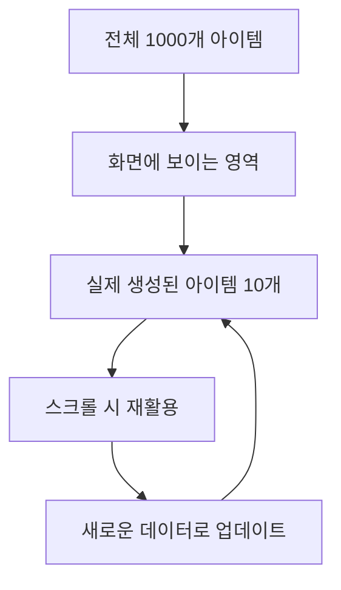
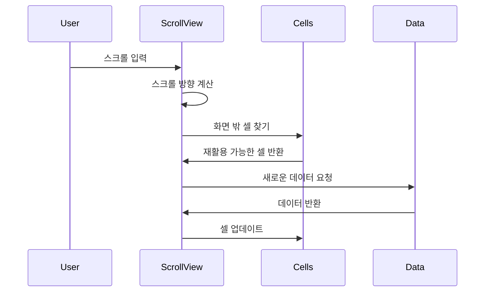

# 대용량 리스트

츄츄버거는 수백 개의 아이템을 효율적으로 표시하기 위해 가상화된 스크롤뷰 시스템을 사용합니다. 이 시스템은 메모리 사용량을 최소화하면서도 부드러운 스크롤링 경험을 제공합니다.

## 핵심 시스템 개요

### RecycleScrollView

대용량 리스트의 핵심인 가상화된 스크롤뷰 컴포넌트입니다.

#### 가상화의 원리



**기본 아이디어:**
- 전체 아이템 중 화면에 보이는 부분만 실제 엔티티로 생성
- 스크롤 시 기존 엔티티를 재활용하여 새로운 데이터로 업데이트
- 메모리 사용량이 아이템 개수에 비례하지 않음

## RecycleScrollView 상세 구조

### 핵심 속성

#### 레이아웃 설정
- **Padding**: 콘텐츠 영역 여백 (Vector4)
- **Spacing**: 아이템 간 간격 (Vector2)
- **ItemsPerLine**: 한 줄당 아이템 수
- **ScrollingType**: 스크롤 방향 (수직/수평)

#### 성능 관련
- **TotalCount**: 전체 아이템 개수
- **MaxContentSize**: 스크롤 가능한 최대 크기
- **CalcCells**: 현재 화면의 계산된 셀들

#### 콜백 시스템
- **onUpdateCell**: 셀 업데이트 시 호출되는 콜백
- **onDragEndCallback**: 드래그 끝에서 호출되는 콜백

### 핵심 메소드

#### 초기화 및 설정
SetTotalCount() 메서드로 총 아이템 수를 설정하고 자동 새로고침을 트리거합니다:

`self.TotalCount = count; self:Refresh(true)`

<details>
<summary>SetTotalCount 메서드 구현</summary>

```lua
-- RootDesk/MyDesk/RecycleScrollView/RecycleScrollView.mlua :: SetTotalCount()
method void SetTotalCount(integer count)
    self.TotalCount = count
    self:Refresh(true)
end
```
</details>

#### 셀 생성 및 재활용
GetOrCreateItem() 메서드로 UI 아이템을 효율적으로 관리합니다:

1. **기존 아이템 확인**: GetChildByName()으로 재사용 가능한 아이템 검색
2. **신규 생성**: 없을 경우 SpawnService로 새 아이템 생성
3. **메모리 효율성**: 기존 아이템 최대한 재활용

<details>
<summary>셀 생성 재활용 로직</summary>

```lua  
-- RootDesk/MyDesk/RecycleScrollView/RecycleScrollView.mlua :: GetOrCreateItem()
method Entity GetOrCreateItem(integer index, Vector3 pos)
    local result = self.Content:GetChildByName("Item"..index)
    
    if result == nil then
        result = _SpawnService:SpawnByEntity(self.Item, "Item"..index, pos, self.Content)
    end
    
    return result
end
```
</details>

#### 셀 업데이트
UpdateCell() 메서드로 각 셀의 데이터와 위치를 업데이트합니다:

1. **인덱스 설정**: cell.CurrentIndex = index로 현재 데이터 인덱스 설정
2. **가시성 제어**: TotalCount 범위 내 셀만 활성화
3. **데이터 바인딩**: onUpdateCell 콜백으로 실제 데이터 설정
4. **위치 업데이트**: anchoredPosition으로 UI 위치 조정

<details>
<summary>셀 업데이트 로직</summary>

```lua
-- RootDesk/MyDesk/RecycleScrollView/RecycleScrollView.mlua :: UpdateCell()
method void UpdateCell(ScrollItem cell, Vector2 position, integer index)
    cell.CurrentIndex = index
    
    if self.TotalCount < index then
        cell.Entity:SetEnable(false)
    else
        cell.Entity:SetEnable(true)
        
        if self.onUpdateCell ~= nil then
            self.onUpdateCell(cell.CurrentIndex, cell.Entity)
        end
    end
    
    cell.Entity.UITransformComponent.anchoredPosition = position
end
```
</details>

### ScrollItem 데이터 구조

각 스크롤 아이템의 메타데이터를 관리하는 구조체입니다:

- **CurrentIndex**: 현재 표시 중인 데이터의 인덱스
- **RealIndex**: 실제 UI 엔티티의 인덱스  
- **Entity**: 연결된 UI 엔티티 참조

<details>
<summary>ScrollItem 구조체 정의</summary>

```lua
-- RootDesk/MyDesk/RecycleScrollView/ScrollItem.mlua
struct ScrollItem
    property integer CurrentIndex -- 현재 데이터 인덱스
    property integer RealIndex    -- 실제 엔티티 인덱스  
    property Entity Entity        -- 연결된 UI 엔티티
end
```
</details>

## 스크롤링 알고리즘

### 수직 스크롤링



#### 수직 이동 처리
MoveVertical() 메서드로 스크롤 이동 시 셀 재배치를 처리합니다:

1. **방향 계산**: CalculateOffset()으로 실제 이동량 조정
2. **셀 재활용**: 스크롤 방향에 따라 보이지 않는 셀들을 반대편으로 이동
3. **데이터 갱신**: 재배치된 셀들에 새로운 데이터 바인딩

핵심 로직: `if dir.y < 0 then -- 위쪽 스크롤` / `elseif dir.y > 0 then -- 아래쪽 스크롤`

<details>
<summary>수직 이동 처리 구현</summary>

```lua
-- RootDesk/MyDesk/RecycleScrollView/RecycleScrollView.mlua :: MoveVertical()
method void MoveVertical(Vector2 dir)
    dir.y += self:CalculateOffset(dir)
    
    if dir.y == 0 then
        return
    end
    
    local tempCells = {}
    if dir.y < 0 then  -- 위쪽 스크롤
        -- 아래쪽 셀들을 재활용하여 위쪽에 배치
        for i = #self.CalcCells, 1, -1 do
            local cell = self.CalcCells[i]
            table.insert(tempCells, cell)
        end
    elseif dir.y > 0 then  -- 아래쪽 스크롤
        -- 위쪽 셀들을 재활용하여 아래쪽에 배치
        for i = 1, #self.CalcCells, 1 do
            local cell = self.CalcCells[i]
            table.insert(tempCells, cell)
        end
    end
    
    -- 셀 재배치 및 데이터 업데이트
    -- ... 복잡한 재배치 로직
end
```
</details>

### 성능 최적화 기법

#### 1. 뷰포트 컬링
화면에 보이지 않는 아이템은 비활성화:
`cell.Entity:SetEnable(false)` — 불필요한 렌더링 방지

#### 2. 배치 계산 최적화
필요한 아이템 수만 계산:
`local maxRow = calcRow + 2` — 기본 표시 수량에 버퍼 2개 추가

#### 3. 경계 검사
CalculateOffset()으로 스크롤 범위 제한:
오버스크롤 방지 및 부드러운 경계 처리

<details>
<summary>성능 최적화 구현</summary>

```lua
-- 뷰포트 컬링
if self.TotalCount < index then
    cell.Entity:SetEnable(false)
else
    cell.Entity:SetEnable(true)
    -- 데이터 업데이트
end

-- 배치 계산 최적화
local calcRow = math.tointeger(size.y / (itemSize.y + self.Spacing.y))
local maxRow = calcRow + 2  -- 버퍼 추가

-- 경계 검사
method number CalculateOffset(Vector2 dir)
    local offset = 0
    -- 경계 검사 및 오프셋 계산
    return offset
end
```
</details>

## 배지 UI 시스템 구현

### UIBadgeList

배지 목록을 표시하는 RecycleScrollView 기반 시스템입니다.

#### 필터링 시스템
SetFilter() 메서드로 배지 목록을 등급과 달성 상태에 따라 필터링합니다:

1. **등급 필터링**: filter 값(9가 전체, 그 외는 특정 등급)에 따라 배지 선택
2. **달성 상태 필터링**: SelectTab에 따라 완료/미완료 배지 분리
3. **리스트 갱신**: 필터링된 배지로 RecycleScrollView 업데이트

핵심 로직: `if self.SelectTab == 1 and isAchieved == true then continue end`

<details>
<summary>배지 필터링 시스템 구현</summary>

```lua
-- RootDesk/MyDesk/18. Badge/UIBadgeList.mlua :: SetFilter()
method void SetFilter(integer filter)
    self.NowFilter = filter
    
    local drawList = {}
    for id, _ in pairs(_BadgeDataSetLogic.BadgeData) do
        local badgeData = _BadgeDataSetLogic:GetBadgeData(id)
        
        -- 등급 필터링
        if self.NowFilter ~= 9 then
            if badgeData.Grade ~= self.NowFilter then
                continue
            end
        end
        
        -- 달성 상태 필터링
        local isAchieved = _UserService.LocalPlayer.PlayerBadge.BadgeAchieved[id]
        if self.SelectTab == 1 and isAchieved == true then
            continue  -- 미완료 탭에서 완료된 배지 제외
        end
        
        table.insert(drawList, id)
    end
    
    self.BadgeList:SetTotalCount(#drawList)
end
```
</details>

#### 정렬 시스템
UISort 값을 기준으로 배지를 오름차순 정렬:

`return aSort < bSort` — 낮은 UISort 값을 가진 배지가 앞에 배치

<details>
<summary>배지 정렬 로직</summary>

```lua
-- 배지 정렬 (UISort 기준)
table.sort(drawList, function(a, b)
    local aSort = _BadgeDataSetLogic:GetBadgeData(a).UISort
    local bSort = _BadgeDataSetLogic:GetBadgeData(b).UISort
    return aSort < bSort
end)
```
</details>

#### 탭 시스템
- **미완료 탭**: 달성하지 않은 배지 표시
- **완료 탭**: 달성한 배지 표시
- **자동 탭 전환**: 모든 배지 달성 시 완료 탭으로 전환

### UIBadgeSlot

각 배지 항목을 표시하는 슬롯 컴포넌트입니다.

#### 표시 요소
- **아이콘**: 배지 아이콘 (달성/미달성 상태별 그레이스케일 적용)
- **등급**: 색상으로 구분되는 배지 등급
- **진행도**: 진행률이 있는 배지의 경우 슬라이더 표시
- **설명**: 배지 이름과 설명 텍스트

#### 상태별 표시
Refresh() 메서드에서 배지 달성 상태에 따라 시각적 표현을 달리합니다:

1. **아이콘 처리**: 달성 시 컬러, 미달성 시 그레이스케일 머터리얼 적용
2. **등급별 색상**: 기본(검은색), 골드(주황색), 다이아몬드(보라색) 구분

핵심 로직: `local materialId = isAchieved and _IconRuidEnum.EmptyMaterial or _IconRuidEnum.GrayScaleMaterial`

<details>
<summary>상태별 표시 구현</summary>

```lua
-- RootDesk/MyDesk/18. Badge/UIBadgeSlot.mlua :: Refresh()
local materialId = isAchieved and _IconRuidEnum.EmptyMaterial or _IconRuidEnum.GrayScaleMaterial
self.Icon:ChangeMaterial(materialId)

-- 등급별 색상
local gradeColor = function(g)
    if g == 0 then return _ColorCodeEnum:GetColor("#161615")     -- 기본
    elseif g == 1 then return _ColorCodeEnum:GetColor("#F78029") -- 골드
    elseif g == 2 then return _ColorCodeEnum:GetColor("#5F48D9") -- 다이아몬드
    end
end
```
</details>

## 활용 사례

### 1. 레시피 목록 (UIRecipeList)
- 수십 개의 레시피를 효율적으로 표시
- 필터링 및 정렬 기능 지원
- 즐겨찾기 시스템 연동

### 2. 재료 선택 UI (UIIngreCardSetting)
- 수백 개의 재료 카드 표시
- 등급별 필터링
- 실시간 검색 기능

### 3. 직원 관리 UI (UIEmployeeManageList)
- 고용된 직원 목록 표시
- 스킬별 정렬 기능
- 상세 정보 팝업 연동

## 메모리 관리 전략

### 1. 오브젝트 풀링
사용하지 않는 엔티티는 삭제하지 않고 비활성화만 처리:
`cell.Entity:SetEnable(false)` — 재사용 가능한 상태로 유지

### 2. 지연 로딩
필요한 시점에만 콜백을 통해 데이터 로딩:
`if self.onUpdateCell ~= nil then self.onUpdateCell(cell.CurrentIndex, cell.Entity) end`

<details>
<summary>메모리 관리 구현</summary>

```lua
-- 사용하지 않는 엔티티는 비활성화만 처리
cell.Entity:SetEnable(false)
-- 실제 삭제는 하지 않음

-- 필요한 시점에만 데이터 로딩
if self.onUpdateCell ~= nil then
    self.onUpdateCell(cell.CurrentIndex, cell.Entity)
end
```
</details>

### 3. 캐시 최적화
- 자주 사용되는 데이터는 캐시
- 계산 결과 재사용
- 불필요한 업데이트 방지

## 성능 측정 지표

### 1. 메모리 사용량
- 전체 아이템 수와 무관하게 일정
- 화면 크기에 비례하는 메모리 사용

### 2. 렌더링 성능
- 화면에 보이는 아이템만 렌더링
- UI 업데이트 최소화

### 3. 스크롤 반응성
- 60FPS 목표 달성
- 부드러운 스크롤링 경험

## 개발자를 위한 가이드

### RecycleScrollView 설정

1. **기본 설정**: 아이템 프리팹, 총 개수, 콜백 함수 설정
2. **레이아웃 조정**: 패딩, 스페이싱, 한 줄당 아이템 수
3. **스크롤 방향**: 수직/수평 선택
4. **스크롤바 연동**: 필요시 스크롤바 컴포넌트 연결

### 커스텀 아이템 구현

1. **아이템 프리팹 생성**: 반복될 UI 요소 프리팹화
2. **데이터 바인딩**: onUpdateCell 콜백에서 데이터 설정
3. **상호작용 처리**: 클릭, 호버 등 이벤트 처리
4. **상태 관리**: 선택 상태, 활성화 상태 등

### 성능 최적화 팁

1. **적절한 버퍼 크기**: 화면 크기에 맞는 여분 아이템 수 설정
2. **업데이트 최소화**: 데이터 변경 시에만 Refresh 호출
3. **텍스처 최적화**: 아이콘과 이미지 압축 및 아틀라스 사용
4. **가비지 컬렉션**: 불필요한 객체 생성 방지

## 코드 참조

### RecycleScrollView 핵심
- `RootDesk/MyDesk/RecycleScrollView/RecycleScrollView.mlua :: OnUpdate(), Refresh(), UpdateCell()` — 가상화된 스크롤뷰 핵심 로직
- `RootDesk/MyDesk/RecycleScrollView/ScrollItem.mlua :: Init()` — 스크롤 아이템 데이터 구조

### 배지 UI 시스템  
- `RootDesk/MyDesk/18. Badge/UIBadgeList.mlua :: SetFilter(), Refresh(), SetSelectTab()` — 배지 목록 관리 및 필터링
- `RootDesk/MyDesk/18. Badge/UIBadgeSlot.mlua :: Refresh(), gradeColor()` — 개별 배지 슬롯 표시

**핵심 인터페이스:**

<details>
<summary>대용량 리스트 핵심 인터페이스</summary>

```lua
-- RecycleScrollView 주요 메소드
method void SetTotalCount(integer count)
method void OnScroll(Vector2 dir)
method void UpdateCell(ScrollItem cell, Vector2 position, integer index)
method Entity GetOrCreateItem(integer index, Vector3 pos)

-- UIBadgeList 주요 메소드  
method void SetFilter(integer filter)
method void SetSelectTab(integer selectTab)
method void Refresh()

-- ScrollItem 구조체
struct ScrollItem
    property integer CurrentIndex
    property integer RealIndex
    property Entity Entity
```
</details>
